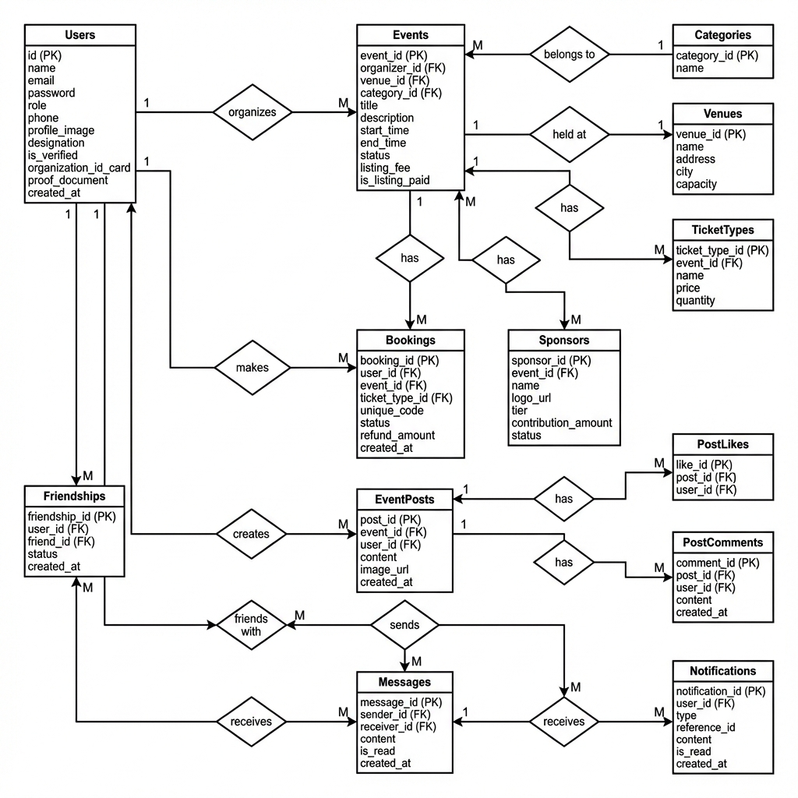

# 🐟 Event Ekhanei - Complete Event Management System

[](https://nextjs.org/)
[](https://www.mysql.com/)
[](https://www.typescriptlang.org/)
[](LICENSE)

A comprehensive, production-ready event management platform built with **Next.js**, **MySQL**, and modern web technologies. Event Ekhanei enables seamless event creation, ticket booking, social networking, real-time chat, and sponsorship management.

---

## 📋 Table of Contents

- [Features](#-features)
- [Tech Stack](#-tech-stack)
- [Database Architecture](#-database-architecture)
- [Getting Started](#-getting-started)
- [Project Structure](#-project-structure)
- [API Documentation](#-api-documentation)
- [Screenshots](#-screenshots)
- [Contributing](#-contributing)
- [License](#-license)

---

## ✨ Features

### 🎫 **Event Management**
- Create, edit, and delete events with rich details
- Custom venue input or selection from existing venues
- Multi-tier ticket types with inventory management
- QR code generation for ticket validation
- Real-time ticket scanning system
- Automatic event filtering (hide past events)
- Event search by title or organizer

### 👥 **User System**
- **Three Role Types:**
  - **Admin:** Manage users, verify organizers, oversee platform
  - **Organizer:** Create events, manage tickets, approve sponsors
  - **Attendee:** Book tickets, apply for sponsorship, attend events
- Profile management with image uploads
- Role upgrade requests (Attendee → Organizer)

### 🤝 **Social Features**
- **Friendship System:** Search users, send/accept friend requests
- **Real-Time Chat:** Direct messaging between friends with polling updates
- **Event Updates:** Organizers post announcements with cloud-hosted images
- **Engagement:** Like and comment on event posts
- **Image Storage:** Cloudinary integration for reliable image hosting

### � **Sponsorship Management**
- Apply to sponsor events (open to all users)
- Tiered sponsorship levels (Partner, Bronze, Silver, Gold)
- Organizer approval workflow
- Logo and contribution tracking

### 🔔 **Notification System**
- **Message Notifications:** Instant alerts for new messages
- **Event Reminders:** 24-hour advance notifications for booked events
- **New Event Alerts:** Broadcast notifications for new events
- Real-time notification bell with unread count

### 🎟️ **Ticketing & QR Codes**
- Unique QR code per ticket
- Mobile-friendly ticket scanner
- Ticket status tracking (Valid, Used, Cancelled)
- Refund policy (Full refund >7 days, 50% refund 2-7 days)

---

## 🛠️ Tech Stack

### **Frontend**
- **Framework:** Next.js 16 (App Router)
- **Language:** TypeScript
- **Styling:** Tailwind CSS (custom design system)
- **UI Components:** React Hooks, Client Components
- **QR Code:** qrcode.react, html5-qrcode

### **Backend**
- **Runtime:** Node.js
- **API:** Next.js API Routes
- **Database:** MySQL 8.0 (TiDB Cloud for production)
- **ORM:** mysql2 (raw SQL for performance)
- **File Storage:** Cloudinary (cloud image storage)

### **Deployment**
- **Platform:** Vercel (serverless deployment)
- **Database:** TiDB Cloud (MySQL-compatible)
- **CDN:** Cloudinary (image hosting)
- **Live URL:** [event-koi.vercel.app](https://event-koi.vercel.app)

### **Key Libraries**
- `uuid` - Unique ticket code generation
- `bcryptjs` - Password hashing
- `cloudinary` - Cloud image uploads
- `next/font` - Optimized font loading

---

## 🗄️ Database Architecture

Event Ekhanei uses a **relational database model** with 13 interconnected tables following industry best practices.

### **Entity-Relationship Diagram**



### **Core Tables**

#### **1. Users**
Stores all user accounts with role-based access control.
```sql
- id (PK)
- name, email, password
- role (ENUM: admin, organizer, attendee)
- phone, profile_image, designation
- is_verified, organization_id_card, proof_document
- created_at
```

#### **2. Events**
Central table for event data.
```sql
- event_id (PK)
- organizer_id (FK → Users)
- venue_id (FK → Venues)
- category_id (FK → Categories)
- title, description
- start_time, end_time
- status (ENUM: DRAFT, PUBLISHED, CANCELLED)
- listing_fee, is_listing_paid
```

#### **3. Bookings**
Tracks ticket purchases and status.
```sql
- booking_id (PK)
- user_id (FK → Users)
- event_id (FK → Events)
- ticket_type_id (FK → TicketTypes)
- unique_code (UNIQUE)
- status (ENUM: VALID, USED, CANCELLED)
- refund_amount, created_at
```

#### **4. Messages**
Enables direct messaging between friends.
```sql
- message_id (PK)
- sender_id (FK → Users)
- receiver_id (FK → Users)
- content, is_read
- created_at
```

#### **5. Notifications**
Centralized notification system.
```sql
- notification_id (PK)
- user_id (FK → Users)
- type (ENUM: MESSAGE, EVENT_REMINDER, NEW_EVENT)
- reference_id (event_id or message_id)
- content, is_read
- created_at
```

### **Database Design Principles**
✅ **Normalization:** 3NF compliance to eliminate redundancy  
✅ **Foreign Keys:** Enforced referential integrity  
✅ **Indexes:** Optimized queries on frequently accessed columns  
✅ **ENUM Types:** Constrained values for status fields  
✅ **Timestamps:** Automatic tracking of creation times  

---

## 🚀 Getting Started

### **Prerequisites**
- Node.js 18+ 
- MySQL 8.0+ (or TiDB Cloud account)
- npm or yarn
- Cloudinary account (free tier available)

### **Installation**

1. **Clone the repository**
```bash
git clone https://github.com/IsTu25/Event-Koi.git
cd Event-Koi
```

2. **Install dependencies**
```bash
npm install
```

3. **Configure Environment Variables**

Create a `.env.local` file in the root directory:
```env
# Database (TiDB Cloud or local MySQL)
DB_HOST=your_db_host
DB_PORT=4000
DB_USER=your_db_user
DB_PASSWORD=your_db_password
DB_NAME=event_koi
DB_SSL=true

# Cloudinary (for image uploads)
CLOUDINARY_CLOUD_NAME=your_cloud_name
CLOUDINARY_API_KEY=your_api_key
CLOUDINARY_API_SECRET=your_api_secret
```

4. **Initialize Database**

Run the database reset script:
```bash
node scripts/reset-database.js
```

This will:
- Drop existing tables
- Create all required tables
- Load seed data
- Create default admin user

5. **Start Development Server**
```bash
npm run dev
```

6. **Access the Application**
```
http://localhost:3000
```

### **Default Admin Account**
After running the database reset script, you can login with:
```
Email: admin@eventkoi.com
Password: admin123
```

### **Deployment to Production**

#### **1. Deploy to Vercel**
```bash
# Install Vercel CLI
npm i -g vercel

# Deploy
vercel
```

#### **2. Set up TiDB Cloud Database**
1. Create account at https://tidbcloud.com/
2. Create a new cluster (free tier available)
3. Get connection details from dashboard

#### **3. Configure Vercel Environment Variables**
Go to Vercel Dashboard → Your Project → Settings → Environment Variables

Add these variables:
```
DB_HOST=your_tidb_host
DB_PORT=4000
DB_USER=your_tidb_user
DB_PASSWORD=your_tidb_password
DB_NAME=event_koi
DB_SSL=true

CLOUDINARY_CLOUD_NAME=your_cloud_name
CLOUDINARY_API_KEY=your_api_key
CLOUDINARY_API_SECRET=your_api_secret
```

#### **4. Initialize Production Database**
Run the reset script locally with production credentials to set up the cloud database:
```bash
node scripts/reset-database.js
```

---

## 📁 Project Structure

```
event-koi/
├── public/
│   ├── uploads/          # User-uploaded files (images, documents)
│   └── er-diagram.png    # Database ER diagram
├── src/
│   ├── app/
│   │   ├── api/          # Backend API routes
│   │   │   ├── auth/     # Login, register
│   │   │   ├── events/   # Event CRUD
│   │   │   ├── bookings/ # Ticket booking
│   │   │   ├── messages/ # Chat system
│   │   │   ├── friends/  # Friendship management
│   │   │   ├── notifications/ # Notification system
│   │   │   └── setup/    # Database initialization
│   │   ├── dashboard/    # Main application pages
│   │   │   ├── page.tsx           # Event listing
│   │   │   ├── event/[id]/        # Event details
│   │   │   ├── tickets/           # My tickets
│   │   │   ├── profile/           # User profile
│   │   │   ├── admin/             # Admin panel
│   │   │   ├── scan/              # QR scanner
│   │   │   └── create-event/      # Event creation
│   │   ├── login/        # Authentication pages
│   │   └── register/
│   └── lib/
│       └── db.ts         # MySQL connection pool
├── README.md
└── package.json
```

---

## 📡 API Documentation

### **Authentication**
- `POST /api/auth/register` - Create new user account
- `POST /api/auth/login` - User login

### **Events**
- `GET /api/events` - List all events (supports `?search=` and `?organizer_id=`)
- `POST /api/events` - Create new event
- `GET /api/events/[id]` - Get event details
- `PUT /api/events/[id]` - Update event
- `DELETE /api/events/[id]` - Delete event

### **Bookings**
- `GET /api/bookings?user_id=` - Get user's tickets
- `POST /api/bookings` - Book a ticket
- `POST /api/bookings/cancel` - Cancel ticket
- `POST /api/bookings/validate` - Validate QR code

### **Social**
- `GET /api/friends?user_id=` - Get friendships
- `POST /api/friends` - Send friend request
- `PUT /api/friends` - Accept/reject request
- `GET /api/messages?user_id=&friend_id=` - Get chat history
- `POST /api/messages` - Send message

### **Notifications**
- `GET /api/notifications?user_id=` - Fetch notifications
- `PUT /api/notifications` - Mark as read

---

## 🎨 Screenshots

### Dashboard


### Event Details


### Ticket with QR Code


### Chat System


---

## 🤝 Contributing

Contributions are welcome! Please follow these steps:

1. Fork the repository
2. Create a feature branch (`git checkout -b feature/AmazingFeature`)
3. Commit your changes (`git commit -m 'Add some AmazingFeature'`)
4. Push to the branch (`git push origin feature/AmazingFeature`)
5. Open a Pull Request

---

## 📄 License

This project is licensed under the MIT License - see the [LICENSE](LICENSE) file for details.

---

## 👨‍💻 Author

**LIHAN Chowdhury**

- GitHub: [@IsTu25](https://github.com/IsTu25)
- Project Link: [https://github.com/IsTu25/Event-Koi](https://github.com/IsTu25/Event-Koi)

---

## 🙏 Acknowledgments

- Next.js team for the amazing framework
- MySQL for robust database management
- Open-source community for invaluable tools and libraries

---

**⭐ If you found this project helpful, please give it a star!**
